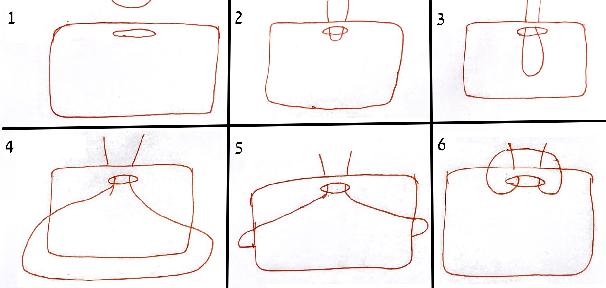

# Signs for opening and closing the aron with strings

Our paroches opened with strings. Pull one string to open and the other to close. These stings looked identical and people would ofter pull the wrong one. I made these signs to allow to easily distinguish the two strings. They also serve as handles to pull the strings.

You can attach the signs to your peroches strings as follows:

