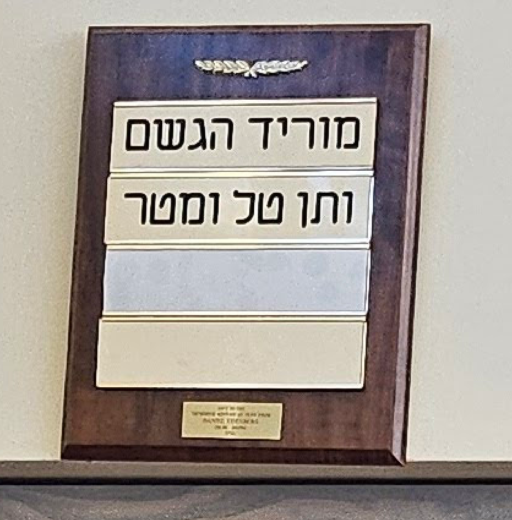

We had a sign in front of the shul to remind people of insertions for shemona esrei:

Someone lost the Ya'ela V'yavo reminder, so I 3d printed a new one. 
Print the top and bottom in one color and the center in a differnt color.
This can be made with 3 parts glued together or with a multi color 3d printer with the top and bottom third one color and the middle third another color.
